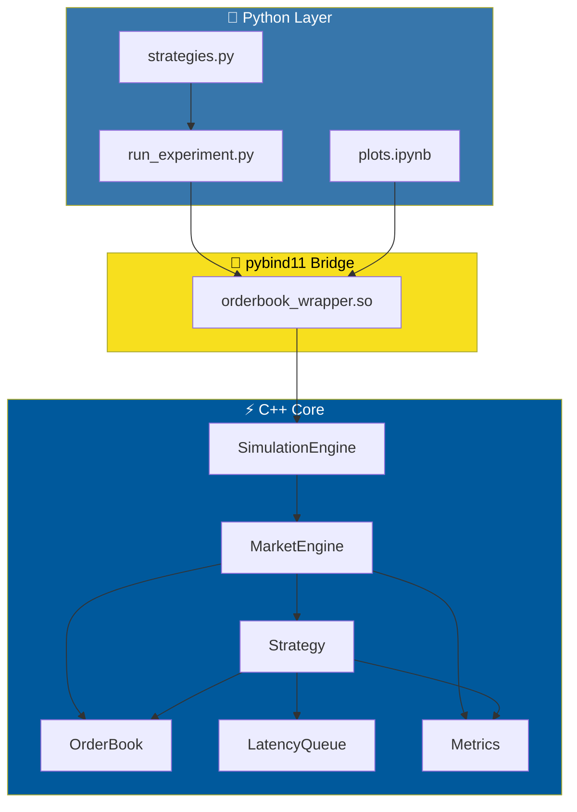
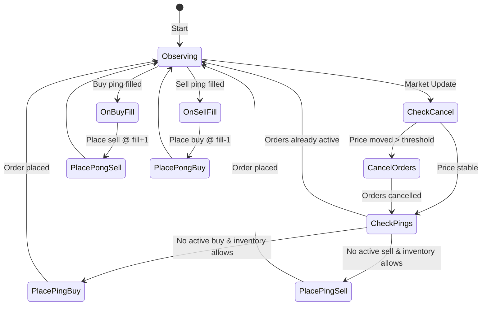

<div align="center">

# ⚡ HFT Strategy Simulator

### A High-Performance C++ Order Book Engine with Latency-Aware Strategy Simulation

[](https://isocpp.org/)
[](https://www.python.org/)
[](https://cmake.org/)
[](https://pybind11.readthedocs.io/)
[](https://google.github.io/googletest/)

*A realistic market microstructure simulation engine for developing and backtesting HFT trading strategies with microsecond-precision latency modeling.*

[Features](#-features) • [Architecture](#-architecture) • [Quick Start](#-quick-start) • [CLI Usage](#-command-line-interface-cli) • [Strategy Guide](#-strategy-the-ping-pong-market-maker) • [API Reference](#-api-reference)

</div>

---

## 🎯 Overview

This project implements a **production-grade HFT simulation framework** designed for quantitative researchers and algorithmic traders. Built from scratch in **modern C++17**, it provides:

- **Realistic Order Book Engine** with price-time priority matching
- **Stochastic Market Dynamics** with volatility clustering and jump diffusion
- **Microsecond-Resolution Latency Simulation** for order routing, fills, and market data
- **Comprehensive Metrics Suite** including Sharpe ratio, drawdown, and fill analysis
- **Python Bindings** via pybind11 for rapid strategy prototyping and analysis

> **Why This Project Exists**: Real HFT systems operate in a world where *latency is alpha*. This simulator captures the essence of that reality—your orders don't execute instantly, market data arrives with delay, and the price can move against you before your cancel reaches the exchange.

---

## ✨ Features

<table>
<tr>
<td width="50%">

### 🏛️ Core Engine (C++)
- **Price-Time Priority Matching** — FIFO order matching at each price level
- **Limit & IOC Orders** — Support for resting and immediate-or-cancel orders
- **O(log N) Operations** — Red-black tree price levels, hash-map order lookup
- **Trade Logging** — Full audit trail of all executions

</td>
<td width="50%">

### 📊 Market Simulation
- **Random Walk + Jumps** — Realistic price dynamics with rare tail events
- **Dynamic Volatility** — EWMA volatility that responds to price moves
- **Adaptive Spreads** — Spread widens with volatility
- **Stochastic Fills** — Distance-based fill probability model

</td>
</tr>
<tr>
<td>

### ⏱️ Latency Modeling
- **Per-Action Latency** — Different delays for orders, cancels, acks
- **Configurable Profiles** — Tune min/max bounds per action type
- **Priority Queue Execution** — Events processed in timestamp order
- **Realistic Scenarios** — Model co-location vs. retail latency

</td>
<td>

### 📈 Analytics
- **Real-Time PnL Tracking** — Realized, unrealized, and total PnL
- **Risk Metrics** — Sharpe ratio, max drawdown, volatility
- **Execution Quality** — Fill ratio, slippage analysis
- **Time Series Export** — Full price/PnL history for visualization

</td>
</tr>
</table>

---

## 🏗️ Architecture



### Component Breakdown

| Component                  | Responsibility                               | Key Design Decision                                         |
| -------------------------- | -------------------------------------------- | ----------------------------------------------------------- |
| **SimulationEngine** | Top-level orchestrator, drives the main loop | Owns `MarketEngine`, handles time progression             |
| **MarketEngine**     | Market dynamics, fill simulation             | Generates price moves, triggers probabilistic fills         |
| **Strategy**         | Trading logic (ping-pong MM)                 | Uses `LatencyQueue` for realistic order timing            |
| **OrderBook**        | Order management, matching engine            | `std::map` for price levels, `std::list` for FIFO queue |
| **LatencyQueue**     | Event scheduling with random delays          | `std::priority_queue` ordered by execution time           |
| **Metrics**          | PnL, risk metrics, time series               | Computes Sharpe ratio, tracks position lifecycle            |

---

## 🗂️ Project Structure

```
hft-strategy-simulator/
├── 📁 include/                    # C++ Headers
│   ├── SimulationEngine.h         # Top-level simulation orchestrator
│   ├── MarketEngine.h             # Market dynamics & fill logic
│   ├── Strategy.h                 # Ping-pong market making strategy
│   ├── OrderBook.h                # Price-time priority order book
│   ├── LatencyQueue.h             # Event-driven latency simulation
│   ├── Metrics.h                  # PnL & risk analytics
│   ├── Order.h                    # Order data structure
│   ├── Trade.h                    # Trade execution record
│   └── TradeLog.h                 # Trade history container
│
├── 📁 src/                        # C++ Implementations
│   └── [*.cpp files]              # ~50KB of core logic
│
├── 📁 bindings/                   # Python-C++ Bridge
│   └── pybind.bindings.cpp        # Comprehensive pybind11 bindings
│
├── 📁 python/                     # Python Interface
│   ├── run_experiment.py          # CLI experiment runner
│   ├── strategies.py              # Strategy parameter profiles
│   └── plots.ipynb                # Visualization & analysis
│
├── 📁 tests/                      # Unit Tests (GTest)
│   ├── test_orderbook.cpp         # 14 order book tests
│   ├── test_strategy.cpp          # 8 strategy tests
│   ├── test_metrics.cpp           # 11 metrics tests
│   ├── test_latency.cpp           # Latency queue tests
│   └── test_market_engine.cpp     # Market simulation tests
│
├── CMakeLists.txt                 # Build configuration
└── README.md                      # You are here
```

---

## 🚀 Quick Start

### Prerequisites

- **C++17 compiler** (GCC 7+, Clang 5+, MSVC 19.14+)
- **CMake 3.14+**
- **Python 3.x** with development headers
- **pybind11** (`pip install pybind11` or via package manager)
- **Google Test** (for running tests)

### Build

```bash
# Clone and build
git clone https://github.com/mert-uzun/hft-strategy-simulator.git
cd hft-strategy-simulator

# Create build directory
mkdir build && cd build

# Configure and compile
cmake ..
make -j$(nproc)
```

### Run Your First Simulation

```bash
cd python

# Run with default balanced strategy
python run_experiment.py

# Try different strategies
python run_experiment.py --strategy aggressive
python run_experiment.py --strategy passive

# Compare all strategies
python run_experiment.py --compare

# Customize parameters
python run_experiment.py --quote-size 5 --tick-offset 1 --duration 60000000
```

---

## 💻 Command-Line Interface (CLI)

The `run_experiment.py` script provides a powerful CLI for running simulations without writing any code.

### Basic Usage

```bash
python run_experiment.py [OPTIONS]
```

### Full Option Reference

```
┌─────────────────────────────────────────────────────────────────────────────┐
│                          COMMAND-LINE OPTIONS                               │
├─────────────────────────────────────────────────────────────────────────────┤
│  STRATEGY SELECTION                                                         │
│  ─────────────────                                                          │
│  -s, --strategy NAME     Strategy profile: aggressive, balanced, passive    │
│  -l, --list              List all available strategies with parameters      │
│  -c, --compare           Run ALL strategies and show comparison table       │
│                                                                             │
│  STRATEGY PARAMETERS (override selected profile)                            │
│  ───────────────────────────────────────────────                            │
│  --quote-size N          Shares per ping order (default: from profile)      │
│  --tick-offset N         Ticks from mid for ping orders                     │
│  --max-inv N             Maximum inventory limit                            │
│  --cancel-threshold N    Ticks movement before cancelling orders            │
│  --cooldown N            Microseconds between requotes                      │
│                                                                             │
│  SIMULATION PARAMETERS                                                      │
│  ─────────────────────                                                      │
│  --start N               Start timestamp in microseconds (default: 1)       │
│  --duration N            Simulation duration in μs (default: 10,000,000)    │
│  --step N                Time step resolution in μs (default: 100)          │
│  --mid-price N           Starting mid price in ticks (default: 10000)       │
│  --spread N              Starting bid-ask spread (default: 2)               │
│  --volatility F          Initial volatility (default: 1.0)                  │
│  --min-volatility F      Minimum volatility floor (default: 0.5)            │
│  --fill-prob F           Base fill probability (default: 0.3)               │
│                                                                             │
│  OUTPUT                                                                     │
│  ──────                                                                     │
│  -q, --quiet             Suppress progress output, show only results        │
│  --help                  Show help message and exit                         │
└─────────────────────────────────────────────────────────────────────────────┘
```

### CLI Examples

```bash
# 📋 List all available strategies
python run_experiment.py --list

# 🏃 Run with aggressive strategy
python run_experiment.py --strategy aggressive

# ⚖️ Compare all strategies head-to-head
python run_experiment.py --compare

# 🎛️ Custom strategy parameters (override balanced profile)
python run_experiment.py -s balanced --quote-size 10 --tick-offset 1

# ⏱️ Run longer simulation (60 seconds)
python run_experiment.py --duration 60000000

# 📈 High volatility market scenario
python run_experiment.py --volatility 3.0 --fill-prob 0.5

# 🔬 Fine-grained simulation (10μs steps for 1 second)
python run_experiment.py --step 10 --duration 1000000

# 🤫 Quiet mode - just show final results
python run_experiment.py -q --compare

# 🚀 Full custom run
python run_experiment.py \
    --strategy aggressive \
    --quote-size 10 \
    --tick-offset 1 \
    --max-inv 50 \
    --duration 30000000 \
    --volatility 2.0 \
    --min-volatility 0.8 \
    --fill-prob 0.4
```

### Strategy Comparison Output

When using `--compare`, you get a side-by-side comparison:

```
================================================================================
STRATEGY COMPARISON
================================================================================
Metric                       Aggressive       Balanced        Passive
--------------------------------------------------------------------------------
Total PnL                          2847           1842            723
Realized PnL                       3156           2156            892
Sharpe Ratio                     1.8734         2.4532         3.1247
Max Drawdown                       -892           -423           -156
Win Rate                         48.23%         52.34%         58.92%
Profit Factor                    1.1523         1.2847         1.4123
Fill Ratio                       72.34%         61.23%         45.67%
Gross Traded Qty                  15234           8234           3421
Fees Paid                          1523            892            342
================================================================================
```

---

### Example Output

```
============================================================
Running simulation: Balanced
============================================================
Strategy: quote_size=3, tick_offset=2, max_inv=10, cancel_threshold=2, cooldown_us=5000
Market: duration=9999999us, step=100us, mid_price=10000, spread=2, vol=1.0, fill_prob=0.3

Running simulation...
[==================================================]

============================================================
RESULTS: Balanced
============================================================

--- PnL Metrics ---
  Total PnL (ticks):            1842
  Realized PnL (ticks):         2156
  Unrealized PnL (ticks):       -314
  Fees Paid (ticks):             892

--- Risk Metrics ---
  Sharpe Ratio:                2.4532
  Max Drawdown (ticks):         -423
  Volatility:                  0.0847

--- Performance Metrics ---
  Win Rate:                    52.34%
  Profit Factor:               1.2847
  Gross Profit:             12847.00
  Gross Loss:               10002.00
```

---

## 🎮 Strategy: The Ping-Pong Market Maker

The included strategy implements a classic **ping-pong market making** approach:

```
                    ┌─────────────────────────────────────────┐
                    │           MARKET MID PRICE              │
                    │               $100.00                   │
                    └─────────────────────────────────────────┘
                                      │
                    ┌─────────────────┼─────────────────┐
                    │                 │                 │
              ┌─────▼─────┐           │           ┌─────▼─────┐
              │   PING    │           │           │   PING    │
              │  BUY @    │           │           │  SELL @   │
              │  $99.98   │◄──────────┼──────────►│  $100.02  │
              │ (offset=2)│           │           │ (offset=2)│
              └─────┬─────┘           │           └─────┬─────┘
                    │                 │                 │
                    │    BUY FILLS    │    SELL FILLS   │
                    │        ▼        │        ▼        │
              ┌─────▼─────┐           │           ┌─────▼─────┐
              │   PONG    │           │           │   PONG    │
              │  SELL @   │           │           │  BUY @    │
              │  $99.99   │           │           │  $100.01  │
              │(fill+1 tick)          │           │(fill-1 tick)
              └───────────┘           │           └───────────┘
```

### Default Strategy Parameters

| Parameter            | Description          | Aggressive | Balanced | Passive |
| -------------------- | -------------------- | :--------: | :------: | :-----: |
| `quote_size`       | Shares per order     |     5     |    3    |    1    |
| `tick_offset`      | Ticks from mid       |     1     |    2    |    3    |
| `max_inv`          | Max position         |     20     |    10    |    5    |
| `cancel_threshold` | Ticks before cancel  |     1     |    2    |    3    |
| `cooldown_us`      | μs between requotes |   1,000   |  5,000  | 10,000 |

### Strategy Lifecycle



---

## ⏱️ Latency Model

The latency system is critical for realistic simulation. Every action incurs a random delay sampled uniformly from configurable bounds:

| Action Type          | Description                  | Default Range (μs) |
| -------------------- | ---------------------------- | :-----------------: |
| `ORDER_SEND`       | Time to send new order       |      50 - 200      |
| `CANCEL`           | Time to cancel order         |      30 - 150      |
| `MODIFY`           | Time to modify order         |      40 - 180      |
| `ACKNOWLEDGE_FILL` | Time to receive fill ack     |      100 - 400      |
| `MARKET_UPDATE`    | Time to receive price update |      50 - 150      |

### Why Latency Matters

```
Without Latency Modeling          With Latency Modeling
─────────────────────────────     ─────────────────────────────
t=0:    See price = 100           t=0:   See price = 100
t=0:    Place buy @ 99  ✓         t=0:   Place buy @ 99
t=0:    Order in book             t=75:  Order arrives (latency!)
                                  ...    Price may have moved!
```

In real markets, this latency creates **adverse selection**—by the time your order arrives, the market may have moved against you. My simulator captures this very crucial dynamic in High-Frequency Trading.

---

## 📊 Metrics Deep Dive

### PnL Calculation

```cpp
// Realized PnL: Closed position profits
realized_pnl += filled_qty * (exit_price - avg_entry_price);

// Unrealized PnL: Open position marked-to-market
unrealized_pnl = position * (mark_price - avg_entry_price);

// Total PnL
total_pnl = realized_pnl + unrealized_pnl - fees;
```

### Sharpe Ratio

```cpp
// Annualized Sharpe Ratio
double raw_sharpe = mean(returns) / std(returns);
double annualization = sqrt(buckets_per_year);
sharpe_ratio = raw_sharpe * annualization;
```

### Fill Probability Model

The probability of a resting order being filled depends on:

1. **Distance from market** — Orders closer to mid fill more often
2. **Current volatility** — High vol = more price movement = more fills
3. **Base fill probability** — Configurable market liquidity parameter

```cpp
double fill_prob = base_fill_prob * exp(-k * distance_to_mid);
```

---

## 🔧 Configuration

### Simulation Parameters

```python
sim_config = {
    "starting_timestamp_us": 1,        # Start time (μs)
    "ending_timestamp_us": 10_000_000, # End time (10 seconds)
    "step_us": 100,                    # Time step resolution
    "starting_mid_price": 10000,       # Initial price (ticks)
    "start_spread": 2,                 # Initial spread (ticks)
    "start_vol": 1.0,                  # Starting volatility
    "min_volatility": 0.5,             # Volatility floor
    "start_fill_prob": 0.3,            # Base fill probability
}
```

### Latency Profiles

```python
# Configure via Strategy.set_latency_config()
strategy.set_latency_config(
    order_send_min=50, order_send_max=200,
    cancel_min=30, cancel_max=150,
    modify_min=40, modify_max=180,
    acknowledge_fill_min=100, acknowledge_fill_max=400,
    market_update_min=50, market_update_max=150
)
```

---

## 📖 API Reference

### Python API (Primary Interface)

```python
import orderbook_wrapper as sim

# Create and run simulation
engine = sim.SimulationEngine(
    starting_timestamp_us=0,
    ending_timestamp_us=1_000_000,
    step_us=100,
    strategy_quote_size=3,
    strategy_tick_offset=2,
    strategy_max_inv=10,
    strategy_cancel_threshold=2,
    strategy_cooldown_between_requotes=5000,
    starting_mid_price=10000,
    start_spread=2,
    start_vol=1.0,
    min_volatility=0.5,
    start_fill_prob=0.3,
)

engine.run()

# Access results
metrics = engine.get_market_engine().get_metrics()
print(f"Sharpe: {metrics.get_sharpe_ratio():.4f}")
print(f"Total PnL: {metrics.get_total_pnl_ticks()} ticks")

# Export time series for plotting
timestamps = metrics.timestamp_series
pnl_series = metrics.total_pnl_ticks_series
```

### C++ API (For Custom Strategies)

```cpp
#include "SimulationEngine.h"

// Run simulation programmatically
SimulationEngine engine(
    /*start*/ 0, /*end*/ 1'000'000, /*step*/ 100,
    /*quote_size*/ 3, /*offset*/ 2, /*max_inv*/ 10,
    /*cancel_thresh*/ 2, /*cooldown*/ 5000,
    /*mid_price*/ 10000, /*spread*/ 2, /*vol*/ 1.0,
    /*min_vol*/ 0.5, /*fill_prob*/ 0.3
);

engine.run();

Metrics& m = engine.get_market_engine().get_strategy().get_metrics();
std::cout << "Sharpe: " << m.get_sharpe_ratio() << std::endl;
```

---

## 🧪 Testing

The project includes comprehensive unit tests covering all components:

```bash
cd build

# Run all tests
./AllTests

# Run with verbose output
./AllTests --gtest_output=xml
```

| Test Suite           | Tests | Coverage                                     |
| -------------------- | :---: | -------------------------------------------- |
| `OrderBookTest`    |  14  | Order matching, cancellation, modification   |
| `StrategyTest`     |   8   | Ping/pong logic, inventory limits, cooldowns |
| `MetricsTest`      |  11  | PnL calculation, Sharpe ratio, drawdown      |
| `LatencyTest`      |  5+  | Event scheduling, latency bounds             |
| `MarketEngineTest` |  5+  | Price dynamics, fill simulation              |

---

## 📚 Design Decisions & Trade-offs

### Why C++ for the Core?

| Consideration               | Decision                                               |
| --------------------------- | ------------------------------------------------------ |
| **Performance**       | Microsecond-level simulation requires minimal overhead |
| **Memory Layout**     | Contiguous storage for cache efficiency                |
| **Determinism**       | No GC pauses during critical paths                     |
| **Industry Standard** | Real HFT systems are written in C/C++                  |

### Why pybind11?

| Alternative  | Why Not                                       |
| ------------ | --------------------------------------------- |
| Cython       | More boilerplate, less C++-native             |
| ctypes       | No C++ support, manual memory management      |
| SWIG         | Complex setup, generated code harder to debug |
| Boost.Python | Heavy dependency, slower compile times        |

### Order Book Data Structures

```cpp
// Price levels: Red-black tree for O(log N) insert/lookup
std::map<long long, std::list<Order>> buys;

// Orders at each level: List for O(1) insert/remove at ends
std::list<Order> orders_at_price;

// Order lookup: Hash map for O(1) access by ID
std::unordered_map<long long, std::tuple<price, iterator>> order_lookup;
```

**Trade-off**: We sacrifice some memory for faster order access. In a real system, you might use a more memory-efficient structure if order counts are extremely high.

### Event-Driven Latency

```cpp
// Priority queue ordered by execution time
std::priority_queue<Event, vector<Event>, std::greater<Event>> event_queue;

// Events carry lambdas for deferred execution
struct Event {
    long long time_to_execute;
    std::function<void(long long)> callback;
};
```

**Trade-off**: `std::function` has some overhead vs. virtual dispatch or type-erased callbacks, but the flexibility for arbitrary actions outweighs the cost at our simulation scale.

---

## 🚀 Future Enhancements

- [ ] **Multi-Asset Support** — Simulate correlated instruments
- [ ] **Custom Strategy Interface** — Plugin architecture for user strategies
- [ ] **Historical Data Replay** — Feed real market data
- [ ] **Order Types** — Stop orders, pegged orders, iceberg orders
- [ ] **Risk Limits** — Real-time position and loss limits
- [ ] **WebSocket Interface** — Live monitoring dashboard

---

## 📄 License

This project is available under the MIT License. See [LICENSE](LICENSE) for details.

---

## 🤝 Contributing

Contributions are welcome! Please feel free to submit a Pull Request. For major changes, please open an issue first to discuss what you would like to change.

---

<div align="center">

**Built for the quant community**

*If this project helped you, consider giving it a ⭐*

</div>
